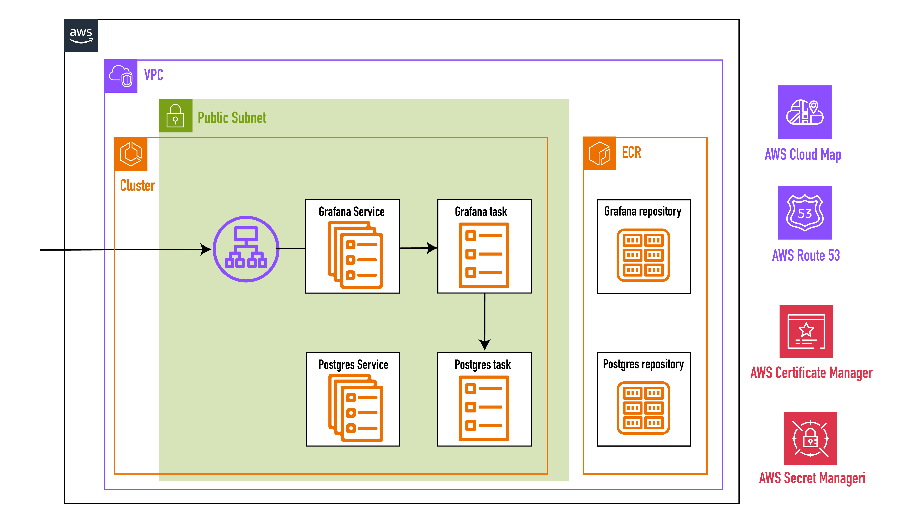

<div align="center">
  <a href="https://optiop.org#gh-light-mode-only">
    
  </a>
  <a href="https://optiop.org#gh-dark-mode-only">
    
  </a>

  <h1>
  Visualize PostgreSql data using Grafana deployed on Amazon Elastic Container Service (ECS)
  </h1>

  <a href="https://optiop.org#gh-light-mode-only">
    
  </a>
  <a href="https://optiop.org#gh-dark-mode-only">
    
  </a>

  <br>

[
  
](https://discord.gg/WkA4PM2dna)
[
  
](./LICENSE)

</div>

The repository contains the terraform code to deploy Grafana and PostgreSql 
on Amazon Elastic Container Service (ECS). 

## Table of Contents
* [Architecture](#architecture)
* [Code Structure](#code-structure)
* [Usage](#usage)
* [References](#references)


## Cloud Architecture

The following diagram shows the architecture of the deployment. It consists of 
two services `grafana` and `postgres` running on ECS. The `grafana` service
is connected to the `postgres` service using the official Grafana PostgreSql
plugin. Through this connection, Grafana can visualize the data stored in the
PostgreSql database. Furthermore, the `grafana` service is exposed to the
internet using an Elastic Load Balancer (ELB).



## Code Structure

The repository contains the following files and directories:

```plaintext
├── LICENSE
├── README.md
├── docs
├── ops
│   ├── ecs
│   │   ├── README.md
│   │   ├── main.tf
│   │   ├── modules
│   │   │   ├── cluster
│   │   │   ├── grafana
│   │   │   ├── postgres
│   │   │   └── vpc
│   │   ├── provider.tf
│   │   └── variables.tf
│   └── repository
│       └── ecr.tf
└── src
    ├── docker-compose.yaml
    ├── grafana
    │   ├── Dockerfile
    │   ├── grafana.ini
    │   └── provisioning
    │       ├── dashboards
    │       │   └── dashboards.yaml
    │       └── datasources
    │           └── postgres.yaml
    └── postgres
        ├── Dockerfile
        └── init.sql
```

* `src` contains the source code for the `grafana` and `postgres` services.
* `ops/repository` contains the terraform code to create the Elastic Container
  Registry (ECR) repository, and required IAM roles.
* `ops/ecs` contains the terraform code to create the ECS cluster, services,

## Usage 

1. Follow the instructions in the [ops/repository/README.md](./ops/repository/README.md)
   to create the Elastic Container Registry (ECR) repository and required IAM roles.
2. Follow the instruction in the [ops/ecs/README.md](./ops/ecs/README.md) to deploy
   the `grafana` and `postgres` services on Amazon Elastic Container Service (ECS).


## References
* [Grafana](https://grafana.com/)
* [PostgreSql](https://www.postgresql.org/)
* [Amazon Elastic Container Service](https://aws.amazon.com/ecs/)